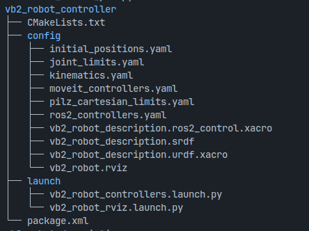
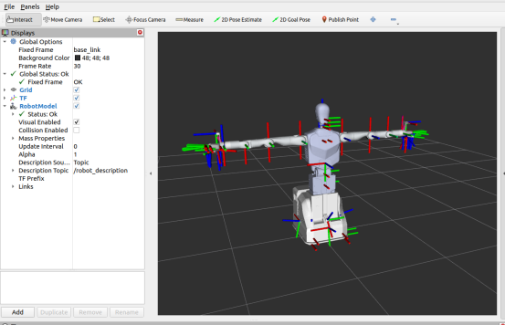

# **ros2_controller功能包**

 

 **/vb2_robot_controller/launch/vb2_robot_controllers.launch.py**

vb2_robot_controllers.launch.py为启动程序，加载urdf模型，并启动控制器

**启动指令为：**

ros2 launch vb2_robot_controller vb2_robot_controllers.launch.py 

 

**头部和腰部hardware控制器**

/joint_control为头部和腰部控制器的hardware，/vb2_robot_controller/config/vb2_robot_description.ros2_control.xacro用于配置hardware，当vb2_robot_controllers.launch.py启动时将激活对应控制器的hardware插件

v**b2_robot_controller/launch/vb2_robot_rviz.launch.py**

vb2_robot_rviz.launch.py为rviz启动程序

**启动指令为：**

ros2 launch vb2_robot_controller vb2_robot_rviz.launch.py 

 

**urdf模型文件**

/vb2_robot_description/urdf/vb2_robot_urdf.urdf

 

# 头部和腰部控制脚本

### /py/head_nod_pub.py头部点头控制

**参数说明：**

- target_position 目标位置（单位：弧度）（头部舵机运动范围[2.61825, 3.66492]，舵机零位为3.14159）

- threshold 目标位置容错

**运行指令：**

python3 head_nod_pub.py --ros-args -p target_position:="[3.1415926]" -p threshold:=0.1

**注：** 由于此程序需要加载自定义的msg包lx_motor_interfaces，因此当运行时提示无法找到lx_motor_interfaces时，需执行 source install/setup.bash

### /py/head_shake_pub.py头部摇头控制

**参数说明：**

- target_position 目标位置（单位：弧度）（头部舵机运动范围[2.61825, 3.66492]，舵机零位为3.14159）

- threshold 目标位置容错

**运行指令：**

python3 head_shake_pub.py --ros-args -p target_position:="[3.1415926]" -p threshold:=0.1

### /py/waist_rotate_pub.py腰部旋转控制

**参数说明：**

- target_position 目标位置（单位：弧度）（腰部俯仰运动范围[-0.785, 0.0]，舵机零位为0.0）

- threshold 目标位置容错

**运行指令：**

python3 waist_rotate_pub.py --ros-args -p target_position:="[0.0]" -p threshold:=0.01

 
