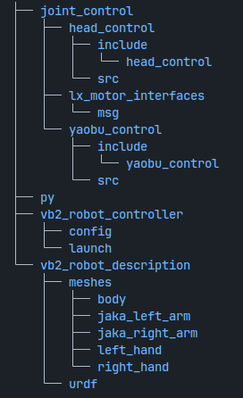
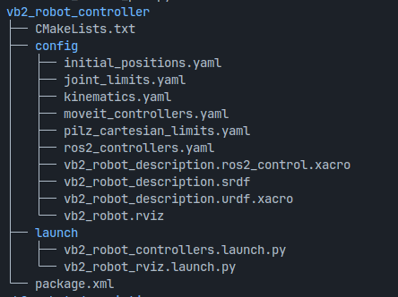
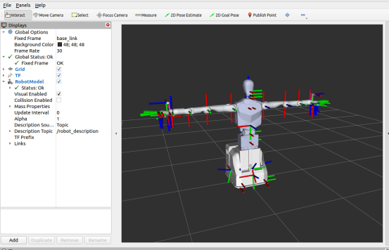

# VB2 ros2_controller Package

  

**File:**  **/vb2_robot_controller/launch/vb2_robot_controllers.launch.py**
This is the launch program, which loads the URDF model and starts the controller.

Launch command:

ros2 launch vb2_robot_controller vb2_robot_controllers.launch.py

  

**The controller hardware for the head and waist is defined in /joint_control.**

The hardware configuration file is **/vb2_robot_controller/config/vb2_robot_description.ros2_control.xacro**.
When vb2_robot_controllers.launch.py is started, the corresponding hardware plugin of the controller will be activated.

**File:**  **/vb2_robot_controller/launch/vb2_robot_rviz.launch.py**
This is the RViz launch program.

**Launch command:**

ros2 launch vb2_robot_controller vb2_robot_rviz.launch.py

  

The URDF model file is located at:

**/vb2_robot_description/urdf/vb2_robot_urdf.urdf**

 

# Head and Waist Control Scripts

### Head Nodding Control

**File: **/py/head_nod_pub.py

**Parameters:** 

- target_position — Target position (unit: radians).
  Head servo range: [2.61825, 3.66492], with zero position at 3.14159. 

- threshold — Tolerance for the target position.

**Run command:**

python3 head_nod_pub.py --ros-args -p target_position:="[3.1415926]" -p threshold:=0.1

**Note:**

Since this program requires loading the custom message package lx_motor_interfaces, if you encounter an error saying that lx_motor_interfaces cannot be found when running, you need to execute:

source install/setup.bash

### Head Shaking Control

**File:** /py/head_shake_pub.py

**Parameters:** 

- target_position — Target position (unit: radians).
  Head servo range: [2.61825, 3.66492], with zero position at 3.14159. 
-  threshold — Tolerance for the target position.

**Run command:**

python3 head_shake_pub.py --ros-args -p target_position:="[3.1415926]" -p threshold:=0.1

### Waist Rotation Control

**File:** /py/waist_rotate_pub.py

Parameters:

- target_position — Target position (unit: radians).
  Waist pitch range: [-0.785, 0.0], with zero position at 0.0. 
-  threshold — Tolerance for the target position.

**Run command:**

python3 waist_rotate_pub.py --ros-args -p target_position:="[0.0]" -p threshold:=0.01